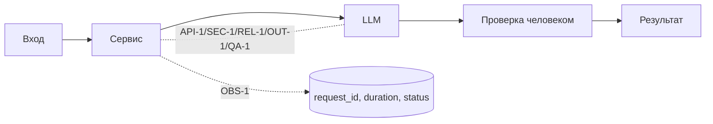

# ADR: решение для первого рабочего сценария

- Статус: proposed
- Дата: 2026-09-11
- Ответственные: команда разработки; владелец сервиса ревью

## Контекст

Учебный сервис AI-помощника ревьюера PR. Вход - diff PR, выход - структурированные рекомендации. В TRAINING_PR.diff реализованы вызов LLM и endpoint `/api/reviews`, но отсутствуют требования из CASE.md: SEC-1, API-1, REL-1, OUT-1, OBS-1, SCOPE-1, QA-1. Формат входа - JSON `{"diff": str}`. Формат выхода по OUT-1 - `{summary, risks<=3{file,line,evidence,risk}, checks[]}`.

## Решение

Ввести слой валидации и нормализации запроса и результата:
- API-1: на входе проверять длину `diff`; при >20000 символов возвращать HTTP 413 без обращения к LLM.
- SEC-1: перед вызовом LLM редактировать секреты (паттерны токенов/паролей/ключей) в диффе, заменяя на `[REDACTED]`.
- REL-1: вызывать LLM через обертку с таймаутом 10с; исключения конвертировать в контролируемый ответ OUT-1 с пустыми списками.
- OUT-1: нормализовать ответ к схеме `{summary, risks<=3, checks[]}`; ограничить `risks` тремя и добавлять только подтвержденные (QA-1).
- OBS-1: писать в лог только `request_id`, длительность, статус; исключить содержимое диффа и ответа.
- SCOPE-1: в ответе фиксировать, что решение принимает человек; сервис только советует.

## Рассмотренные альтернативы

| Альтернатива | Почему не выбрали сейчас |
|---|---|
| Свободный текст без структуры OUT-1 | Непроверяемо, не автоматизируется проверка рисков и чеков; нарушает OUT-1/QA-1 |
| Синхронный вызов LLM без таймаута | Риск зависаний и деградации SLA; противоречит REL-1 |
| Игнорировать SEC-1/API-1 | Риск утечки секретов и DoS на длинных диффах; нарушение требований кейса |

## Последствия и главный риск

- Положительные последствия:
- Стандартизированный выход, управляемая деградация, снижение операционных рисков, воспроизводимые проверки.
- Ограничения: требуется поддержка шаблонов редактирования секретов; возможна потеря части контекста из-за редактирования.
- Главный риск: ложноположительное редактирование или пропуск секрета, искажающие контекст для LLM.
- Как проверим риск: unit-тесты на паттерны секретов; интеграционные тесты с синтетическими секретами; ручной аудит нескольких кейсов.

## Архитектурная схема

## Как использовали AI

- Для чего: структурировать архитектурное решение и альтернативы по правилам CASE.md.
- Тип промпта: master-prompt
- Строка в [`prompts.md`](prompts.md): P1-02
- Что проверили и исправили сами: Соотносимость с другими артефактами проекта.
