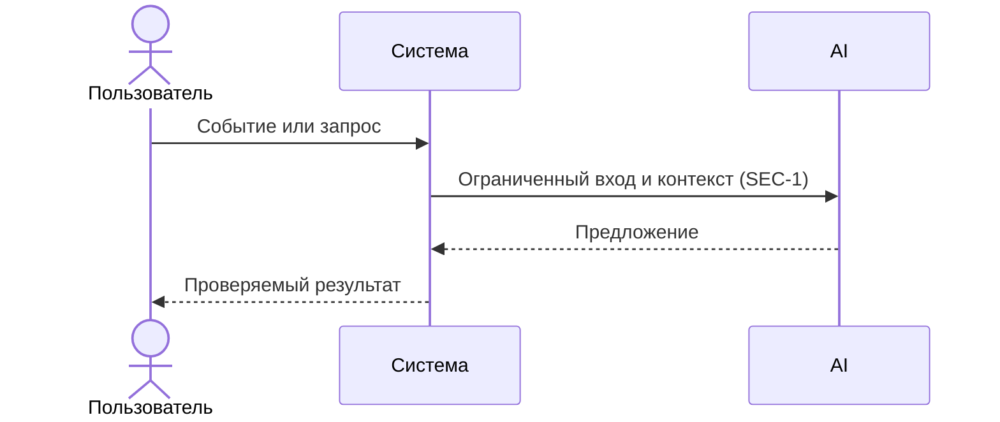

# Use cases и user stories

## Первый рабочий сценарий

**Когда** пользователь отправляет валидный diff на `/api/reviews`, **система** редактирует секреты, вызывает LLM с таймаутом и возвращает структурированный ответ по OUT-1, **а пользователь получает** проверяемое резюме, до трех рисков и список проверок.

Не входит в этот сценарий:

- Автоматический merge/approve PR; правки кода; интеграции с внешними системами кроме LLM.

## Use case

| Поле | Значение |
|---|---|
| Актор | Разработчик/ревьюер |
| Триггер | Отправка POST `/api/reviews` с JSON `{"diff": str}` |
| Предусловия | Diff длиной <= 20000 символов; сеть доступна |
| Основной результат | HTTP 200 с JSON по OUT-1: `summary`, `risks` (<=3), `checks` |
| Ошибка или отказ | HTTP 413 при oversize; контролируемый OUT-1-ответ при таймауте LLM |



## User stories и acceptance criteria

```gherkin
Feature:

  Scenario: Позитивный
    Given валидный diff длиной 5000 символов без секретов
    When я отправляю POST /api/reviews с телом {"diff": "..."}
    Then получаю 200 и тело со строкой summary, массивом risks (0..3) с полями file,line,evidence,risk и массивом checks (>=1)
    And поля соответствуют схеме OUT-1

  Scenario: Негативный или граничный
    Given diff длиной 20001 символ
    When я отправляю POST /api/reviews
    Then получаю статус 413 и тело с описанием отказа без выполнения LLM
```

## Как использовали AI

- Для чего: зафиксировать первый сценарий и проверяемые критерии.
- Тип промпта: master-prompt
- Строка в [`prompts.md`](prompts.md): P1-02.
- Что проверили и исправили сами: Соотносимость с другими артефактами проекта
