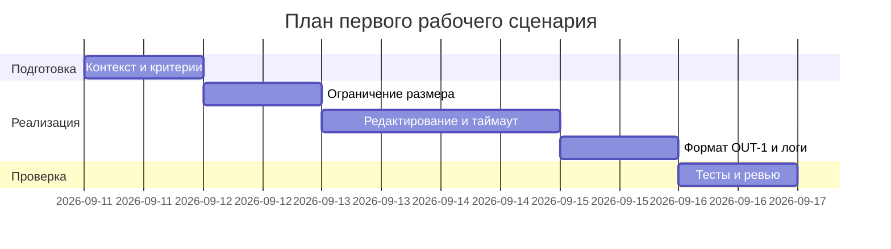

# План поставки

## Инкременты и ответственность

| Инкремент | Наблюдаемый результат | Что делает человек | Что делает AI или субагент | Проверка | Зависимости |
|---|---|---|---|---|---|
| 1 | API валидирует размер и возвращает 413 при >20000 | Уточняет пороги и формат ошибок | Генерирует шаблон обработчика валидации | Интеграционный тест oversize -> 413 | CASE.md API-1 |
| 2 | Редактирование секретов и таймаут LLM 10с | Определяет паттерны секретов | Генерирует функцию редактирования и таймаут-обертку | Unit: секрет -> [REDACTED]; Fault-инъекционный тест таймаута | CASE.md SEC-1, REL-1 |
| 3 | Ответ соответствует OUT-1; логи по OBS-1 | Финализирует схему ответа и поля логов | Предлагает маппинг ответа и маскирование логов | Integration happy path; проверка логов | CASE.md OUT-1, OBS-1 |

## Диаграмма Ганта

Замените даты и задачи на свой план.

## Как использовали AI

- Для чего: разложить поставку на инкременты с проверками.
- Тип промпта: master-prompt
- Строка в [`prompts.md`](prompts.md): P1-02.
- Что проверили и исправили сами: Соотносимость с другими артефактами проекта
